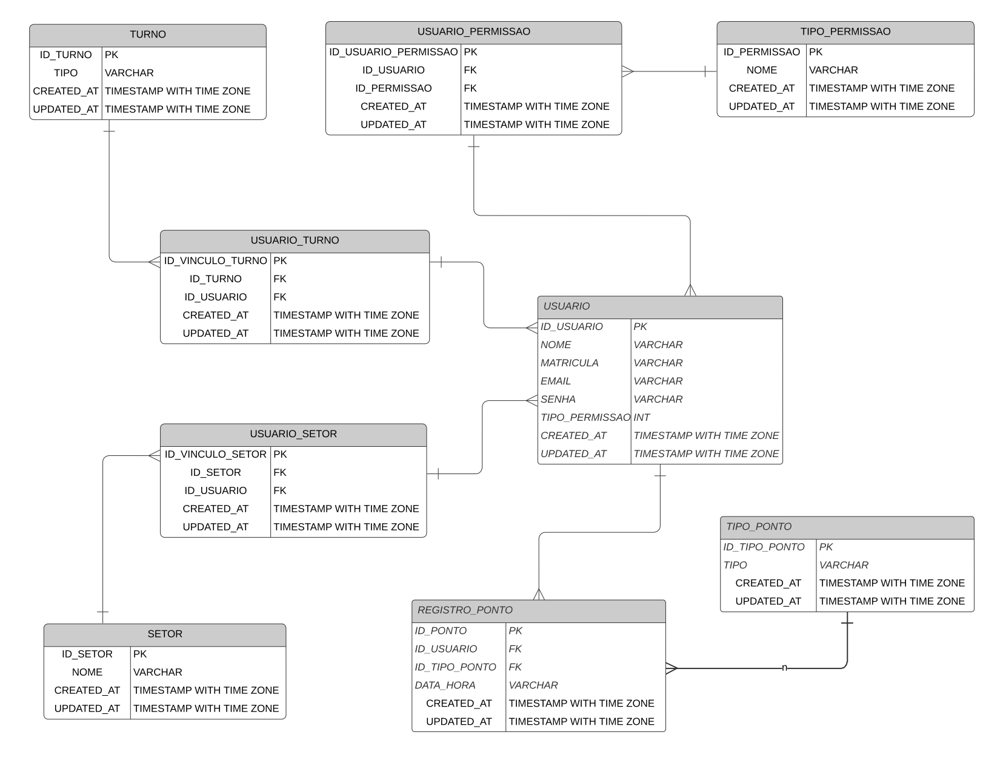

# point_db
Db para testes

#### Estrutura do DB

# steps for using

# step 1 - clone repo

git clone git@github.com:TiagoOliverDev/db_point_abstract.git

cd db_point_abstract

# step 2 - create env

python -m venv nome_da_env

nome_da_env/Scripts/activate

pip install -r requirements.txt

# step 3 - config PgAdmin

This migrate is not yet 100% functional, it is not creating the database in PgAdmin, so you must manually create the database and allocate the name of the database in the "db_name" variable on line 14 in the db_migrate.py file

# step 4 - run script

Once this is done, now you can do a python db_migrate.py and it will generate the tables
